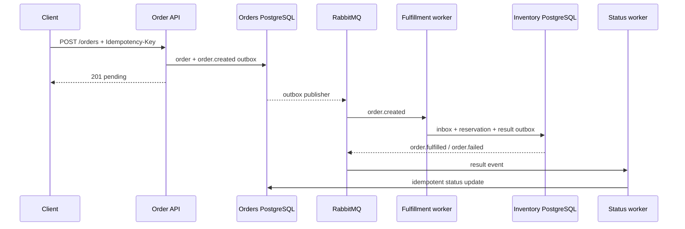

# OrderMesh

Микросервисная обработка заказов с отдельными хранилищами, идемпотентностью,
transactional outbox/inbox, retry-очередью, DLQ и сквозным correlation ID.

## Что демонстрирует проект

- `Idempotency-Key`: повтор запроса возвращает тот же заказ, изменённое тело — `409`;
- отдельные PostgreSQL-базы сервиса заказов и сервиса остатков;
- асинхронное резервирование товара через RabbitMQ;
- transactional outbox в обеих базах и идемпотентные inbox consumers;
- ограниченные повторы через TTL retry queue;
- dead-letter queue после исчерпания попыток;
- propagation `X-Correlation-ID` через HTTP, события и логи;
- блокировки строк запасов против overselling;
- сценарий нагрузки на 20–30 RPS;
- OpenAPI, healthcheck, миграции, seed и интеграционные тесты.

## Поток заказа



При временной ошибке сообщение идёт в очередь с TTL и возвращается в основной
exchange. После трёх повторов исходное событие сохраняется в DLQ, а заказ
переходит в `failed` с диагностической причиной.

## Быстрый запуск

```bash
docker compose up --build --detach
```

- Swagger UI: <http://localhost:8040/docs>
- healthcheck: <http://localhost:8040/health>
- RabbitMQ Management: <http://localhost:15684> (`ordermesh / ordermesh`)

Пример заказа:

```bash
curl -X POST http://localhost:8040/api/v1/orders \
  -H 'Content-Type: application/json' \
  -H 'Idempotency-Key: checkout-2026-0001' \
  -H 'X-Correlation-ID: web-checkout-42' \
  -d '{"customer_email":"buyer@example.com","items":[{"sku":"BOOK-FASTAPI","quantity":1}]}'
```

Seed создаёт SKU `BOOK-FASTAPI`, `COURSE-ASYNC` и `LICENSE-PRO`.
`simulate_transient_failures` — только демонстрационный параметр для проверки
retry/DLQ; в обычном запросе он равен `0`.

## Проверки и нагрузка

```bash
docker compose --profile test up --build \
  --abort-on-container-exit --exit-code-from test test
uv sync --extra dev
uv run ruff format --check .
uv run ruff check .
uv run mypy src
```

```bash
uv run python scripts/load.py --rps 25 --seconds 10
```

Сценарии отказа и границы консистентности описаны в
[`docs/architecture.md`](./docs/architecture.md).

## English summary

OrderMesh is an event-driven order-processing system with separate Orders and
Inventory PostgreSQL databases. Idempotency keys protect the HTTP boundary;
transactional outbox/inbox tables protect message boundaries; bounded retry
queues, a DLQ, correlation IDs and row-level inventory locks make failures and
concurrency observable.
